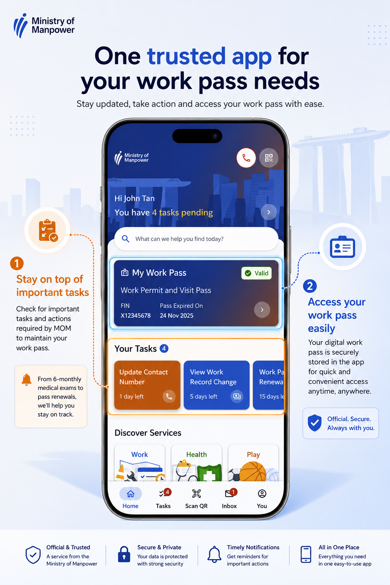

# WorkPass Connect

**One trusted app for your work pass needs** — a task-driven, official work pass app concept that helps Work Pass Holders stay updated, take action, and access their work pass with ease.

  

## About

WorkPass Connect is a mobile app concept for the Ministry of Manpower (MOM) that puts everything a Work Pass Holder needs in one place. The app is built around two core values that drive adoption and engagement:

1. **Stay on top of important tasks** — Users are reminded of important tasks and actions required by MOM to maintain their work pass, from 6-monthly medical exams and contact updates to pass renewals. Timely reminders help users stay compliant and avoid disruptions.
2. **Access your work pass easily** — The digital work pass is securely stored in the app and displayed prominently on the homepage, giving users quick and convenient access anytime, anywhere, while reinforcing that this is the official and trusted app.

## Key Features

- **My Work Pass** — Digital work pass card (Work Permit and Visit Pass) with validity status, FIN, and expiry date at a glance
- **Your Tasks** — Actionable task cards with deadlines (e.g., update contact number, view work record change, work pass renewal)
- **Discover Services** — Quick access to Work, Health, and Play services
- **Scan QR** — Built-in QR scanning for verification
- **Inbox & Notifications** — Timely reminders for important actions
